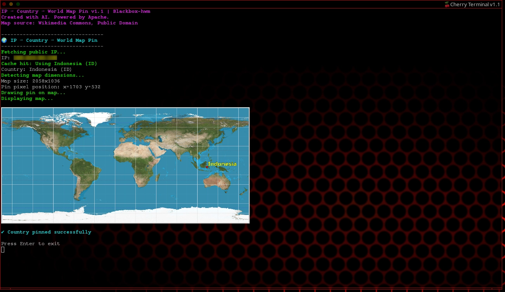

# 🌐 IP Geolocation Lookup Tool

A **graphical IP geolocation tool for Linux terminals**, written in **Perl** and designed for **kitty-based terminal consoles**. It detects your public IP address, resolves its country via GeoIP, pins the location on a world map, and renders everything **directly inside the terminal**.

Ideal for **Cherry Terminal** running on the **Blackbox-hwm** window manager, but fully usable on any Linux system with the required dependencies.

---

## ✨ Features

* **IP Detection** – Fetches your public IP using `icanhazip.com`
* **Geolocation Lookup** – Resolves country data via `geoiplookup`
* **Caching** – Avoids repeated lookups by caching results locally
* **Graphical World Map** – Downloads a world map, pins your location with a red marker, and renders it in-terminal
* **Robust Error Handling** – Graceful fallbacks when services or tools are unavailable
* **Customizable** – Easily extend country centroids or replace the map source

---

## 🖼️ Demo



### Example Output

```
🌐 IP & Geolocation Lookup Tool 🌍

Powered by icanhazip.com, geoiplookup, and viu

🔍 Fetching your IP address...
📡 Your IP: 192.168.1.1

🗺️  Looking up geolocation...

━━━━━━━━━━━━━━━━━━━━━━━━━━━━━━━━━━━━━━━━
🌍 Country: Indonesia
━━━━━━━━━━━━━━━━━━━━━━━━━━━━━━━━━━━━━━━━

🖼️  Displaying Graphical World Map:
📍 Your approximate location: Indonesia

✅ Lookup complete! Stay secure online. 🔒
```

---

## 📦 Installation

### Prerequisites

Ensure the following are installed:

* **Perl** – Script runtime
* **curl** – IP fetching
* **geoiplookup** – Geolocation resolution
* **viu** – Terminal image rendering
* **ImageMagick** – Map pinning and image manipulation
* **Map image** – Included with the repository

> **Optional:** Apache (or any web server) if you want to fetch the map image remotely. You may also place the map image locally instead.

---

### Install Steps

Clone the repository:

```bash
git clone https://github.com/fpucore/ip-country-world-map-pin
cd ip-country-world-map-pin
```

Make the script executable:

```bash
chmod +x ip-geo-lookup.pl
```

Run the tool:

```bash
./ip-geo-lookup.pl
```

---

## 🚀 Usage

### Basic Usage

```bash
./ip-geo-lookup.pl
```

### Launcher Script

Use the included launcher to open the tool in a new **kitty** terminal window:

```bash
./launch-ip-geo.pl
```

The launcher keeps the terminal open and prompts the user before exit.

---

## 🛠️ Customization

* **Add Countries** – Extend `%COUNTRY_CENTROID` in the script
* **Map Source** – Change `$MAP_URL` to point to a different image
* **Cache Location** – Cached results are stored in:

  ```
  ~/.cache/ip_geo_lookup/
  ```

---

## 📚 Dependencies

### Perl Modules

* `Term::ANSIColor`
* `File::Path`

### External Tools

* `curl`
* `geoiplookup`
* `viu`
* `ImageMagick`

### Platform

* **Linux** (tested on **H-Linux with Blackbox-hwm**, but works on other distributions with dependencies installed)

---

## 🔗 System-wide Installation (Optional)

To make the tool available globally:

```bash
sudo ln -s ip-world-country-map-pin/ip-geo-lookup.pl /usr/bin/ip-geo-lookup
```

---

## 📄 License

This project is licensed under the **MIT License**. See the `LICENSE` file for details.

---

## 🤝 Contributing

Contributions are welcome!

1. Fork the repository
2. Make your changes
3. Submit a pull request

---

## 🙏 Credits

* **Developer:** Chris McGimpsey-Jones ([chrisjones.unixmen@gmail.com](mailto:chrisjones.unixmen@gmail.com))
* **Map Source:** Wikimedia Commons (Public Domain)
* **Inspiration:** Blackbox-hwm on H-Linux

---

## 🆘 Support

If you encounter issues:

* Verify all dependencies are installed
* Ensure internet access for IP and map fetching
* Open an issue on GitHub with details

---

Enjoy exploring your digital location from the terminal! 🌍
